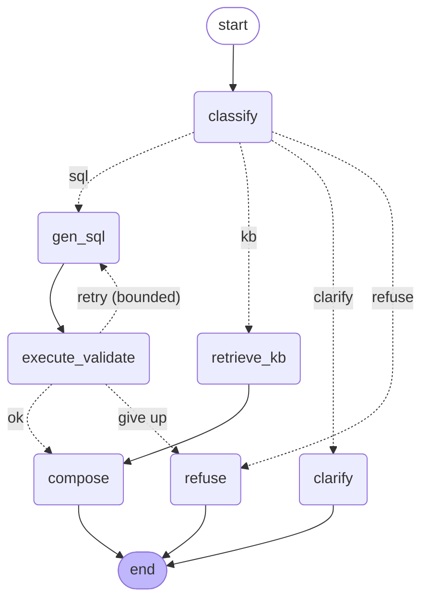

# Architecture

## Overview

The copilot answers business questions over a three-tier beverage-distribution
dataset. Two answer sources are unified behind one agent:

- **Text-to-SQL** for quantitative questions over the DuckDB mini-DB.
- **RAG** over a 7-document policy/glossary knowledge base for definitions,
  policies, and eligibility.

The non-negotiable design goal is **trust**: the system shows the SQL it ran and
the KB it cited, refuses to answer what the data can't support, and asks for
clarification when a question is ambiguous — instead of guessing.

## Part B — the agent graph (LangGraph)

### Nodes

| Node | Responsibility |
|------|----------------|
| `classify` | LLM routes the question to `sql` / `kb` / `clarify` / `refuse` with a confidence score. Low confidence on a data/KB route is downgraded to `clarify`. |
| `gen_sql` | Generates one read-only `SELECT` grounded in the schema card. On a retry it is given the prior error to self-correct. |
| `execute_validate` | Runs the SQL through the **safety guard** + read-only engine, then validates the result (non-empty, numeric sanity). Increments the retry counter on failure. |
| `retrieve_kb` | TF-IDF top-k retrieval over the KB chunks, returning passages with their source ids. |
| `compose` | Builds the final answer. **Numbers come only from the executed SQL** (never invented by the LLM); the model only phrases verified figures. KB answers are grounded in the retrieved passages with citations. |
| `clarify` | Returns a clarifying question (e.g. for ambiguous "underperformance"). |
| `refuse` | Declines — either because the data can't answer (no forecast table) or because no validated query could be produced after retries. |

### State

A typed `AgentState` (TypedDict) flows through the graph: the question; routing
decision + confidence; the SQL, execution result, and validation issues; KB
hits; and the final answer, citations, status, and an ordered `trace` of nodes
visited (for explainability). See `src/copilot/agent/state.py`.

### Loop & termination control

- The only cycle is `gen_sql → execute_validate → gen_sql`, and it is **bounded**:
  `execute_validate` increments `retries`, and the conditional edge loops back
  only while `retries <= max_retries` (default 1 → at most 2 SQL attempts).
  After that it terminates at `refuse`.
- Every other path is acyclic and ends at `END`.
- **Confidence gating**: a shaky classification (confidence < 0.5) is routed to
  `clarify` rather than answered.

### How we know an answer is wrong

- The **guard** rejects unsafe or malformed SQL before it runs.
- **Validation** flags empty results and implausible values (e.g. negative
  revenue) and forces a retry or refusal.
- A **golden-SQL oracle** (`offline_fixtures` + `eval/`) lets the eval harness
  compare the agent's executed answer to known-correct values.
- Answers always surface their **SQL / KB source**, so a reviewer can audit the
  reasoning, not just the number.

## Worked examples

### Clarification (Q4 — "Show me our underperforming accounts")

`classify → clarify`. KB-01 states performance has no single definition, and
KB-07 says to ask rather than guess. The agent responds:

> "Performance at ABC has no single definition — it's always reported against a
> specific metric (net revenue, case volume, or margin) and a specific period.
> Which metric and over what period should I use, and how do you want
> 'underperforming' defined (e.g. bottom decile, or below a threshold)?"
> *(cites KB-01, KB-07)*

### Refusal (Q9 — "What is our projected net revenue for next quarter?")

`classify → refuse`. KB-06 records that there is no forecast/budget table, and
KB-07 forbids fabrication. The agent declines and offers a historical alternative
rather than inventing a projection. *(cites KB-06, KB-07)*

## Part A — Text-to-SQL + RAG details

- **Grounding** (`schema_card.py`): structural schema (tables/columns/types) +
  value grounding (the distinct literals of categorical columns) + business
  semantics distilled from KB-01..KB-07 (net vs gross, approved reimbursement,
  calendar quarters, tier eligibility, "no forecast table"). The card is injected
  into the SQL prompt with prompt caching.
- **SQL safety** (`sql/guard.py` + `sql/execute.py`): a single read-only
  `SELECT` only; table/column allowlist; no DML/DDL/IO functions; engine-level
  read-only connection; row cap and interrupt-based time limit.

## Part C — retention model

See `partc/` and the write-up: a leakage-guarded pipeline (drops
`offboarding_ticket_flag`, reconciles the `payment_terms` train/serve encoding
mismatch, imputes missing values), model selection on cross-validated PR-AUC,
probability calibration, a ranked at-risk list for the serve feed, and impact
(holdout experiment) + production (drift monitoring, retraining) design.
